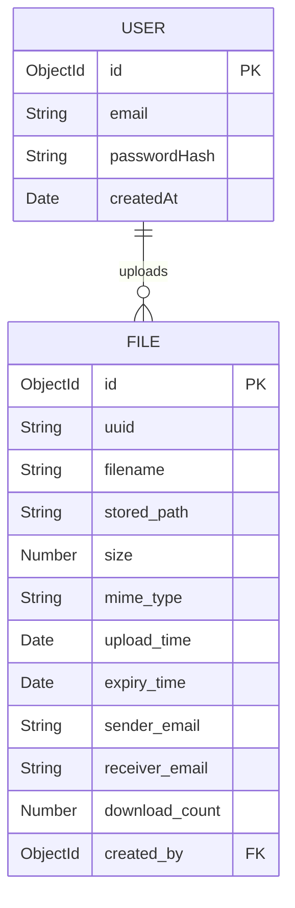
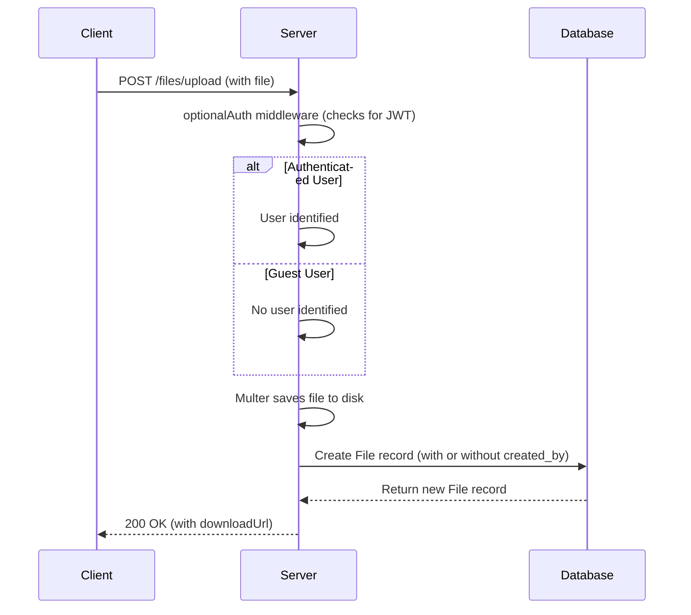
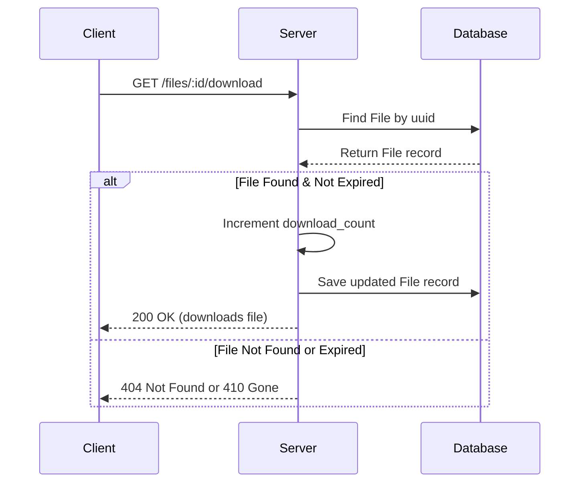

# File Sharing App (WeTransfer Clone)

This is a full-stack file sharing application, similar to WeTransfer, that allows users to upload large files and share them via a unique, expiring link.

## ✨ Features

- **File Upload:** Upload large files (PDFs, ZIPs, images, etc.).
- **Shareable Links:** Instantly generate a unique, unguessable download link for each file.
- **Email Sharing:** Optionally send the download link directly to a recipient's email.
- **Link Expiry:** All links are temporary and automatically expire after a configurable period (e.g., 24 hours).
- **Automatic Cleanup:** Expired files are automatically deleted from the server to save space.
- **Download Tracking:** See how many times a file has been downloaded.
- **Optional User Accounts:** Sign up and log in to keep track of your uploaded files.
- **Secure:** Built with security in mind, including rate limiting and secure headers.

---

## 🛠 Tech Stack

### Backend
- **Node.js & Express.js:** For the core API and server logic.
- **MongoDB & Mongoose:** As the database for storing file metadata and user information.
- **Passport.js (JWT Strategy):** For secure, token-based authentication.
- **Multer:** For handling file uploads.
- **Nodemailer:** For sending emails.
- **`node-cron`:** For scheduling the automatic cleanup of expired files.
- **`express-rate-limit`:** To protect against brute-force attacks.
- **`helmet`:** To secure the app with various HTTP headers.

### Frontend
- **React.js:** For the user interface.
- **Vite:** As the build tool for the frontend.

---

## 📁 Folder Structure

The project is organized into a `client` and `server` directory.

```
/
├── client/         # React Frontend
│   ├── public/
│   └── src/
├── server/         # Node.js Backend
│   ├── src/
│   │   ├── config/         # Passport.js configuration
│   │   ├── middleware/     # Express middleware (auth, etc.)
│   │   ├── models/         # Mongoose schemas
│   │   ├── routes/         # API routes
│   │   └── utils/          # Utility scripts (e.g., cleanup)
│   ├── uploads/        # Directory for stored files
│   ├── .env            # Environment variables
│   └── server.js       # Main server entry point
└── README.md
```
---

## 📊 Diagrams

### Entity-Relationship Diagram (ERD)

This diagram shows the relationship between the `User` and `File` models.



### File Upload Sequence Diagram

This diagram illustrates the process of uploading a file, both for guests and authenticated users.



### File Download Sequence Diagram

This diagram illustrates the process of downloading a file.


---

## 🚀 Getting Started

### Prerequisites

- Node.js (v16.x or higher)
- npm
- MongoDB (running locally or on a cloud service like MongoDB Atlas)
- A Gmail account for sending emails (if you want to use the email feature)

### Installation & Setup

1.  **Clone the repository:**
    ```bash
    git clone <repository-url>
    cd file-sharing-app
    ```

2.  **Setup the Backend:**
    ```bash
    cd server
    npm install
    ```
    - Create a `.env` file in the `server` directory by copying `.env.example`.
    - Fill in the required environment variables in the `.env` file (see below).

3.  **Setup the Frontend:**
    ```bash
    cd ../client
    npm install
    ```

### Environment Variables

You need to create a `.env` file in the `server` directory and fill in the following variables:

```
PORT=5000
MONGO_URI=your_mongodb_connection_string
JWT_SECRET=a_strong_secret_for_jwt
BASE_URL=http://localhost:5000
LINK_EXPIRY_HOURS=24
EMAIL_USER=your_gmail_address@gmail.com
EMAIL_PASS=your_gmail_app_password
UPLOAD_DIR=./uploads
ADMIN_TOKEN=a_secure_random_string_for_admin_tasks
```
**Note on `EMAIL_PASS`:** You will need to generate an "App Password" for your Google Account to use Gmail with Nodemailer. You can find instructions on how to do that [here](https://support.google.com/accounts/answer/185833).

### Running the Application

1.  **Start the Backend Server:**
    ```bash
    cd server
    npm run dev
    ```
    The server will be running on `http://localhost:5000`.

2.  **Start the Frontend Development Server:**
    ```bash
    cd client
    npm run dev
    ```
    The React app will be available at `http://localhost:5173` (or another port if 5173 is busy).

---

## 🧪 API Testing with Postman

A Postman collection is included in the root of the project: `file-sharing-app.postman_collection.json`.

You can import this collection into Postman to easily test all the API endpoints. The collection is pre-configured with variables for the `baseUrl`, `token`, and `fileId` to streamline the testing process.

---

## API Endpoints

### Health Check
- `GET /health`: Checks if the server is running.

### Authentication
- `POST /auth/signup`: Register a new user.
- `POST /auth/login`: Log in and receive a JWT.
- `GET /me`: Get the current user's information (protected).

### Files
- `POST /files/upload`: Upload a file.
- `GET /files/:id/meta`: Get metadata for a file.
- `GET /files/:id/download`: Download a file.
- `POST /files/:id/send-email`: Send the download link to an email address.

### Admin
- `DELETE /admin/cleanup`: Manually trigger the cleanup of expired files.
